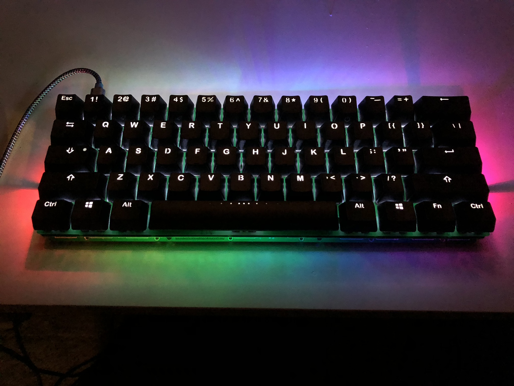
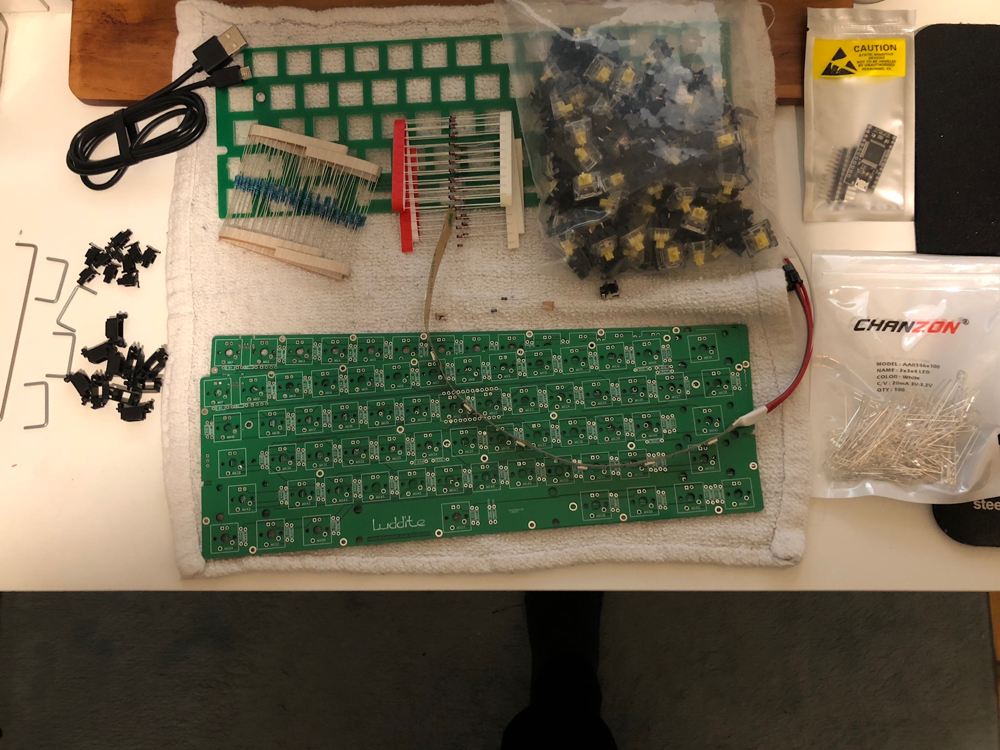
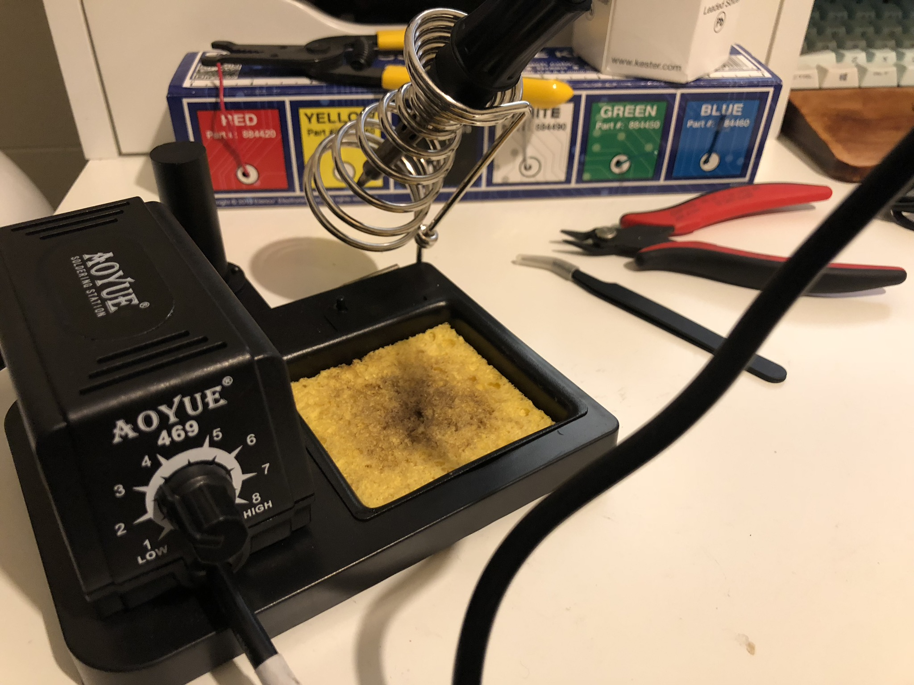

# Luddite Build Guide

A complete Luddite build can take anywhere from 2-6 hours. Pace yourself!

At the end of the process, you'll wind up with something like this:

Before we begin, let's take inventory and make sure we have all the parts necessary.

## Inventory
There are required part and optional parts. Some of the optional parts are required for LED backlighting support.

### Required
- 2x Luddite PCBs
- 61x 1N4148 Diodes
- 4x 2U Stabilizers and 1x 6.25U Stabilizer
- Pro Micro
- Peel-a-way Sockets
- Micro USB Cable
- USB Mini Connector
- Mini USB Cable
- 61x Cherry MX Style Switches
- At least 6x M2 10mm standoffs and 12x M2 4mm screws
- 4-6 Rubber Bumpons
### Optional
- 1x Luddite Plate (For plate mount switches)
- 1x WS2812b LED Strip with 8 LEDs (For RGB Underglow)
- MOSFET (For LED Backlight)
- 61x 470 Ohm Resistors (For LED Backlight)
- 61x LEDs (For LED backlight)
- 1x 100 ohm and 1x 100k ohm resistor (For LED Backlight)
- Tactile Reset Switch (For easy re-flashing)
- ESD Suppression Diode (For ESD Protection)

## Tools
You also have to have a base set of tools to complete this build.
- Soldering Iron
- Solder
- Philips head Screwdriver
- Flush cutters
- Tweezers
- Wire strippers
- Solid core wire (For RGB Underglow only)

If you're not sure what to get, I highly recommend the [Keeb.io recommended soldering tools guide](https://docs.keeb.io/soldering-tools/)

## The Process
1. Decide if you want to support RGB Underglow and LED Backlighting. This will change what you have to do during the build process.

1. (Optional, LED Backlighting) If I'm supporting LED backlighting, I like to start off with the 100 ohm and 100k ohm resistors. This is so I won't make a mistake later. The colors on the resistors should match the ones shown 