# Luddite Build Guide

A complete Luddite build can take anywhere from 2-6 hours. Pace yourself!

At the end of the process, you'll wind up with something like this:

Before we begin, let's take inventory and make sure we have all the parts necessary.

## Inventory
There are required part and optional parts. Some of the optional parts are required for LED backlighting support.

### Required
- 2x Luddite PCBs
- 61x 1N4148 Diodes
- 4x 2U Stabilizers and 1x 6.25U Stabilizer
- Pro Micro
- Peel-a-way Sockets
- Micro USB Cable
- USB Mini Connector
- Mini USB Cable
- 61x Cherry MX Style Switches
- At least 6x M2 10mm standoffs and 12x M2 4mm screws
- 4-6 Rubber Bumpons
### Optional
- 1x Luddite Plate (For plate mount switches)
- 1x WS2812b LED Strip with 8 LEDs (For RGB Underglow)
- MOSFET (For LED Backlight)
- 61x 470 Ohm Resistors (For LED Backlight)
- 61x LEDs (For LED backlight)
- 1x 100 ohm and 1x 100k ohm resistor (For LED Backlight)
- Tactile Reset Switch (For easy re-flashing)
- ESD Suppression Diode (For ESD Protection)

## Tools
You also have to have a base set of tools to complete this build.
- Soldering Iron
- Solder
- Philips head Screwdriver
- Flush cutters
- Tweezers
- Wire strippers
- Solid core wire (For RGB Underglow only)

If you're not sure what to get, I highly recommend the [Keeb.io recommended soldering tools guide](https://docs.keeb.io/soldering-tools/)

## The Process
  
Decide if you want to support RGB Underglow and LED Backlighting. This will change what you have to do during the build process.

### First Resistors for LED Backlighting (Optional, LED Backlighting) 

If I'm supporting LED backlighting, I like to start off with the 100 ohm and 100k ohm resistors. This is so I won't make a mistake later. 

The colors on the resistors should match the ones shown.  
The 100 ohm resistor is colored brown, black, brown.  
The 100k ohm resistor is colored brown, black, yellow.  

Find the spots on the board where these resistors should go. They are labeled:

Put the resistors through their respective holes. Bend the leads before installing the resistors:

On the underside of the board, solder the resistors to their pads:

Finally, flush cut the resistors close to the board:

You'll be repeating this process many times throughout this build.

### Diodes (Required)

The next thing we're going to do is install all 61 diodes.
Your diodes come in a long strip. I like installing them in groups of 6, but you can find what works for you.

First, bend the legs of the diodes to make them easier to insert. I bend them around my finger. 
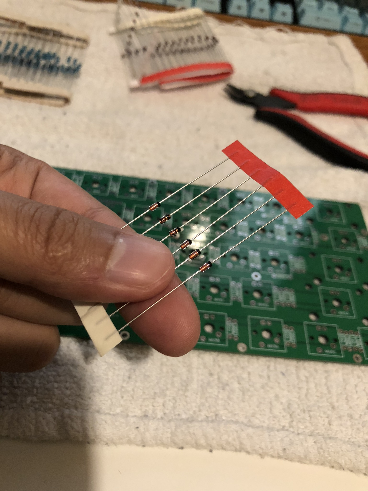

Next, insert the diodes into the spots marked with the letter "D" on the PCB. Make sure the black band on the diode aligns with the bands marked on the PCB.

For the most part, the bands point upwards, but sometimes the diodes are sideways.

Bend the legs of the diodes to hold them in place so you can turn the PCB over:

Solder the legs of the diodes to the pads, and flush cut the legs off. Make sure you save your legs! We'll be using them later to socket our ProMicro.

Repeat this process until all 61 diodes have been installed, being careful to align the bands in the correct direction:
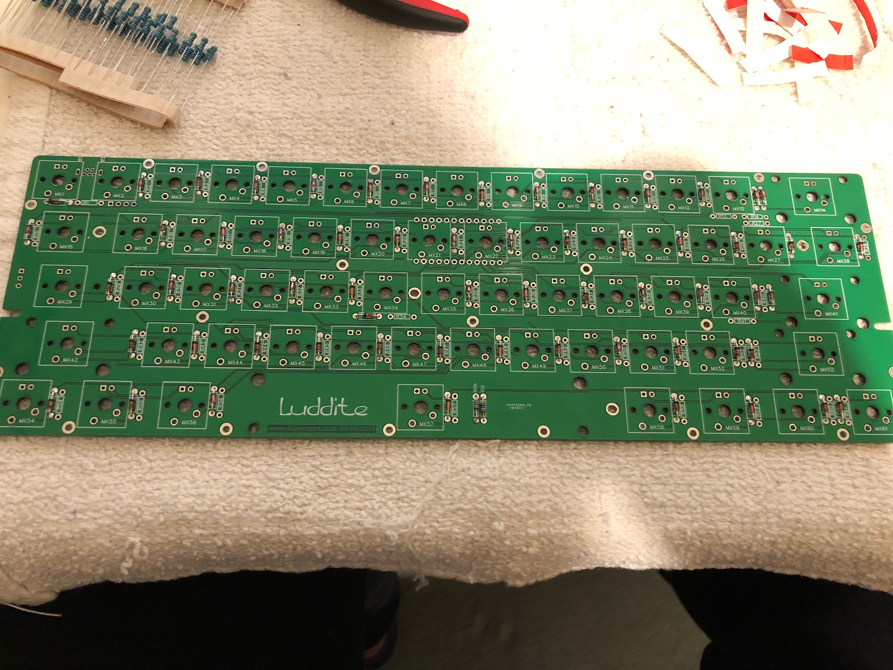

### Resistors (LED Backlighting, Optional)

Next, we'll install our 470 ohm resistors. Note that in this build guide, I used 510 ohm resistors, so yours might look a little different.

On all the spots marked with an "R" on the PCB, install your resistors, following the same process you used with the diodes. For resistors, direction doesn't matter. We also don't need to save the legs.

Repeat the process until complete

### USB Mini Port

Align the USB mini port with holes on the PCB for the USB mini port, and insert the port into the holes

Solder all the leads on the back side of the board. Make sure all 5 pins made it through their holes:

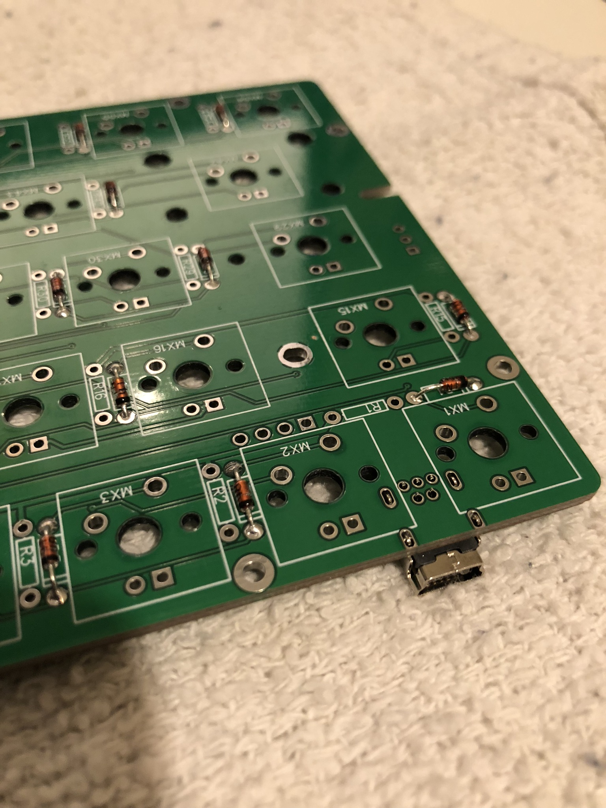

### Tactile Reset Switch (Optional)
Now that we've had lots of practice soldering, we'll move on to some Surface Mount (SMD) parts. We'll start with the easiest - the tactile switch.

Note that if you're intimidated by this, it's completely optional. Unless you're adding LED Backlighting, soldering SMD parts are optional.

That said, you can definitely do it, and having a reset switch is super helpful!

Start by adding solder to one of the 4 pads for the tactile reset switch:
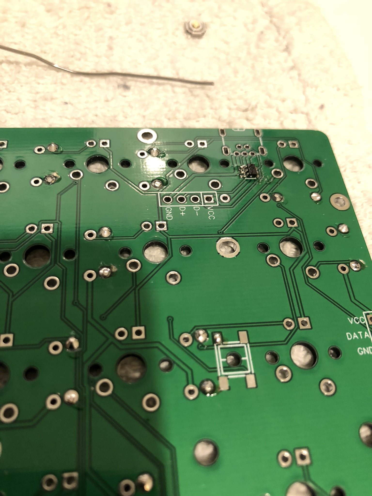

Next, use your tweezers to align the reset switch with the soldered pad. Using your other hand, touch your soldering iron to the solder, and use your tweezers to place your switch in place. 

You can use your soldering iron and tweezers until you're satisfied with the placement. When done with that, solder the other three leads.

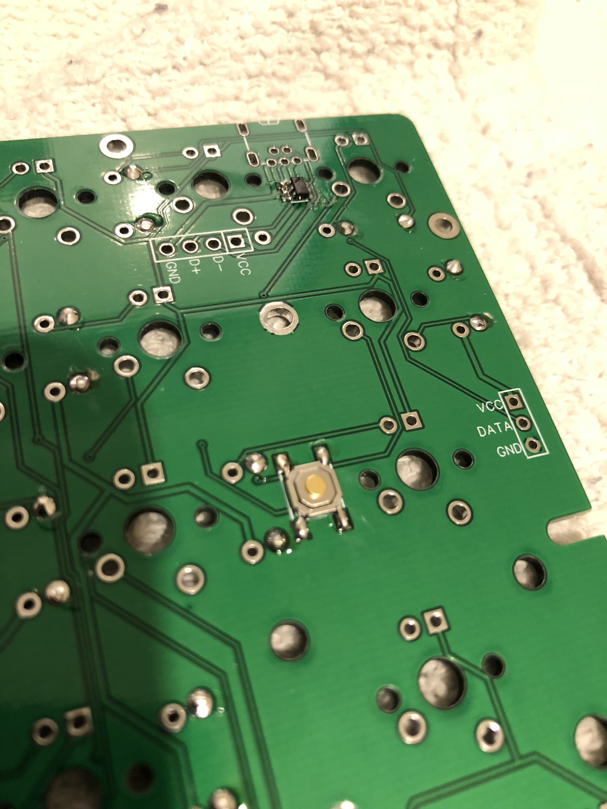

### MOSFET (Optional, Required for LED Backlight)
Next we'll install the MOSFET. This is required for LED backlighting.

We're going to follow the same process as the reset switch, but first, let's figure out how to orient our MOSFET. There is a dot on the PCB where the MOSFET should go. There is also a dot on the MOSFET component. Make sure they are aligned when placing the MOSFET.

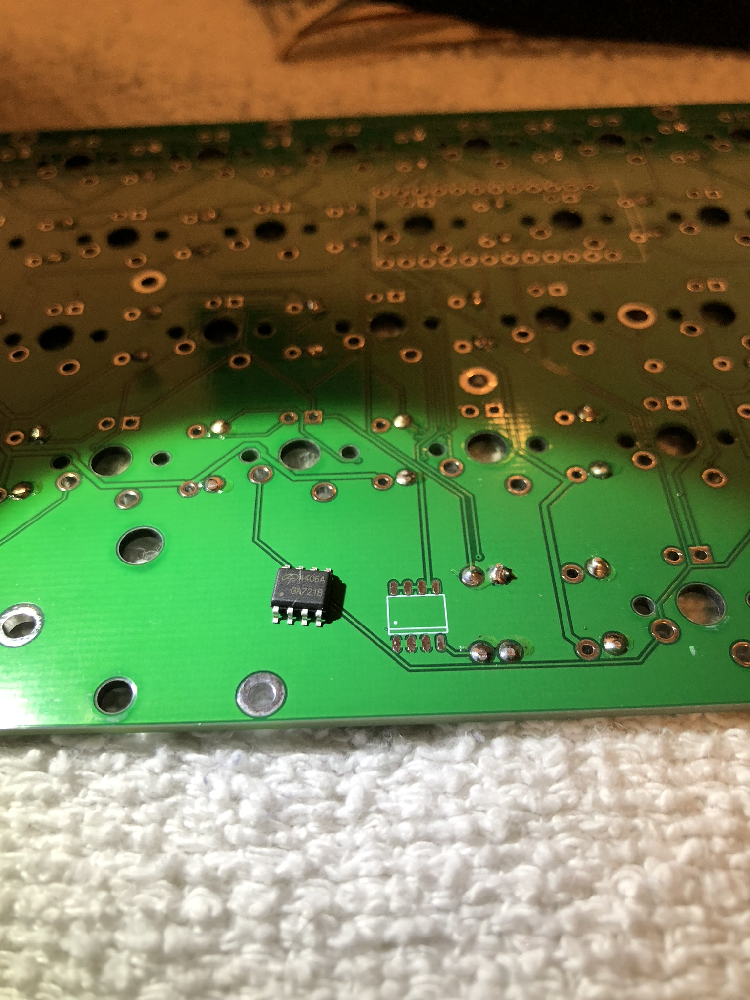

As before, add solder to one of the MOSFET's pads:

Using tweezers and your soldering iron, place and align the MOSFET:

Solder the remaining leads to their pads:

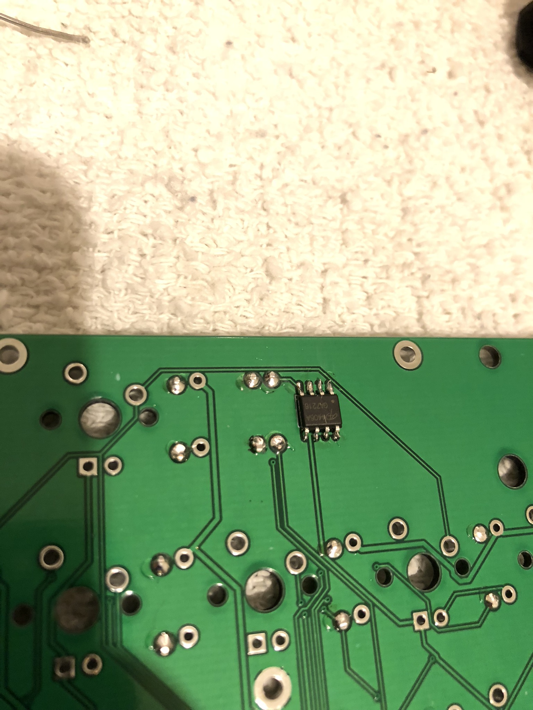

### ESD Protection Diode (Optional)

The last SMD component we're going to install is the ESD protection diode, following the same process. It's much smaller than the other SMD components - so if you're uncomfortable doing this, feel free to skip it.  This also has a dot on both the PCB and component for alignment.

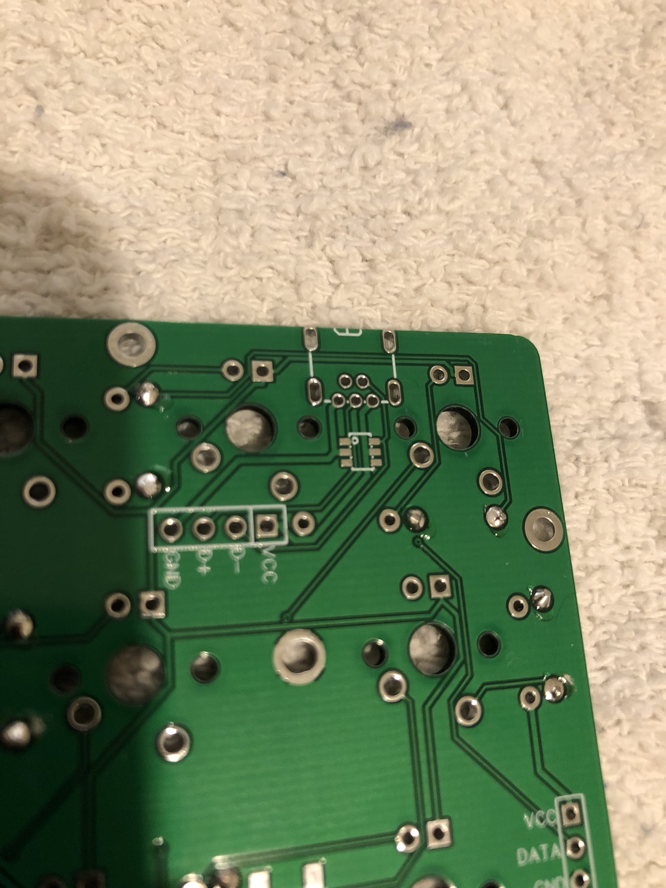

Add solder to a single pad, place and align the component, and finish soldering the other pads.

NOTE: This is way too much solder above

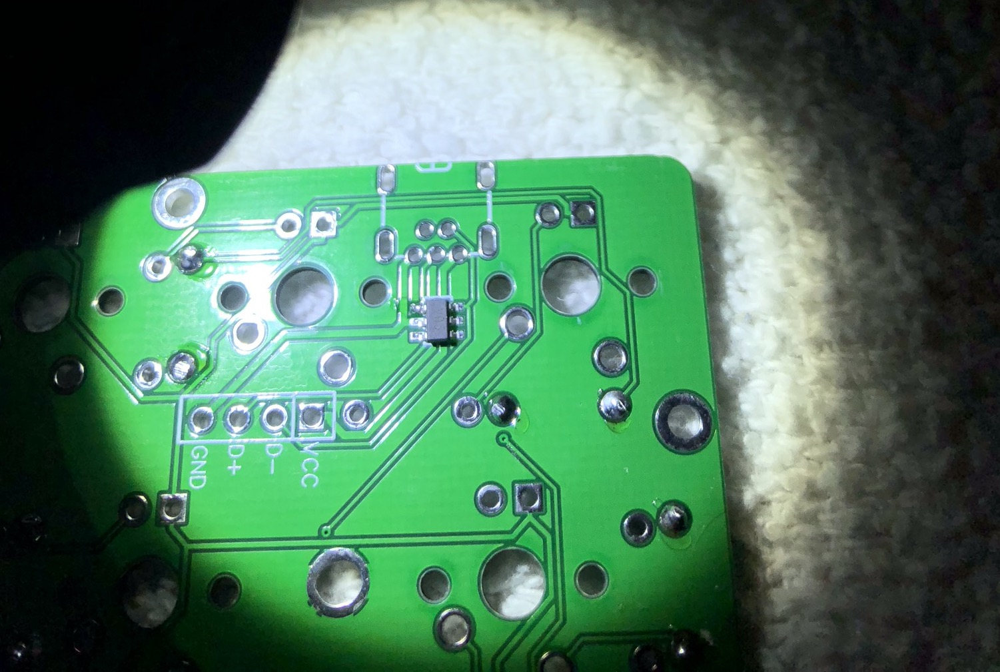

### Alignment and Mounting

At this point, we're almost ready to add switches and stabilizers. We need to decide now we're going to mount our PCB.

There are two options - interior mount and exterior mount. 

For exterior mount, we'll use our M2 hardware along the exterior of the PCB. If we are using a plate though, this means we will not be able to remove the screws from the top PCB without desoldering, due to spacing reasons.

With interior mount, we'll sandwich our PCBs using the 6 mounting holes that are also used in mounting a PCB to a case:
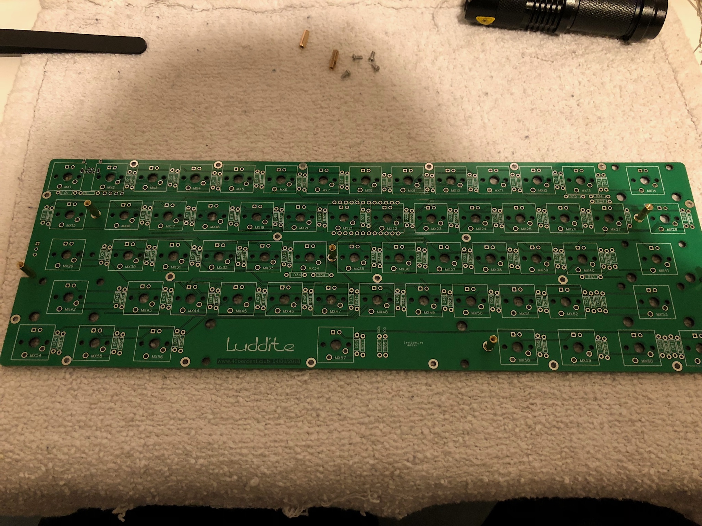

The plate has holes for these, so we will be able to remove them.

The exterior mount might be stronger, but the interior mount will give you more flexibility in the future. If you're using a plate or plan on moving your Luddite to a case, I recommend interior mount.

At this point, if you are choosing to use exterior mount with a plate, install your mounting hardware in your PCB.

### Stabilizers

Now we must assemble and install our stablilzers. At this point, you should clip and lube your stabilizers.

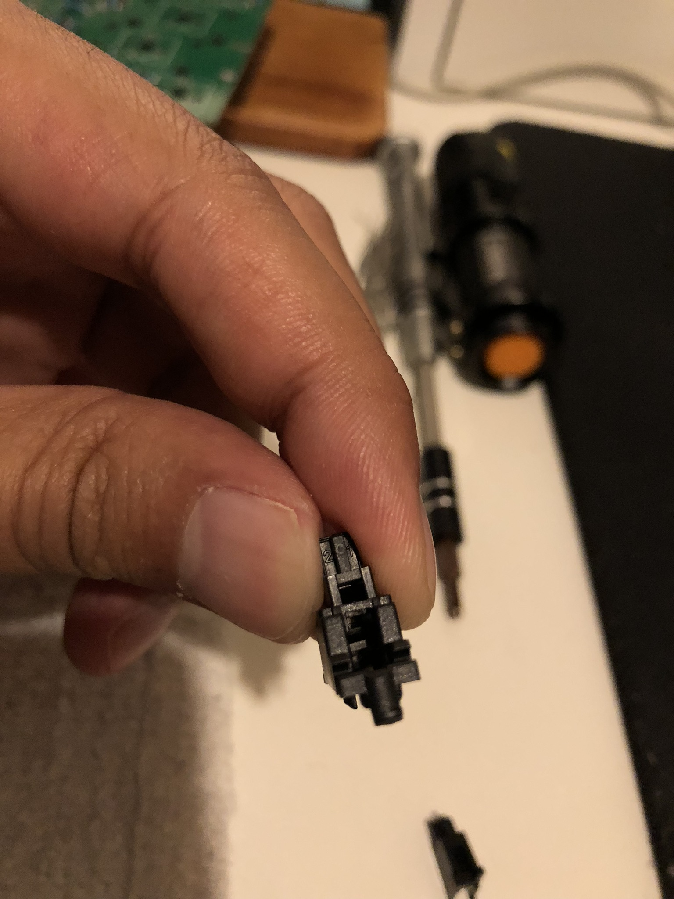

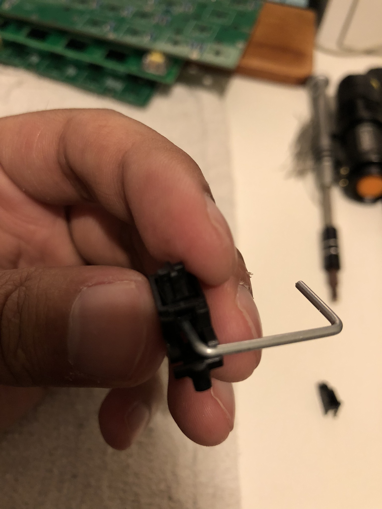

If using PCB mount stabilizers, install them in your PCB. Slide the larger part of the stabilizer into the larger hole on the PCB, and press firmly on the smaller part until it clicks into the hole.

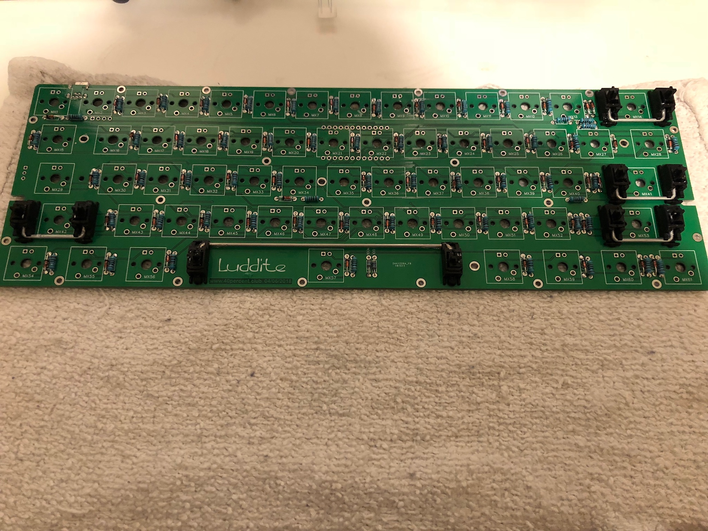

If you're using a plate, I recommend using the plate stabilizers. Install them into your plate. PCB stabilizers will work, but it's a tight fit, and others have had them get stuck - you may have to do some light sanding of the plate, where the PCB stabs rub the plate.

### Switches

Finally, we can install our switches. If using a PCB mounted switch, go ahead and press all your switches into the PCB

If using a plate, I like starting with the 4 corners of the plate. Your plate might be a little tight around the stabilizers, but they will fit. (Note, this picture does not show stabilizers)

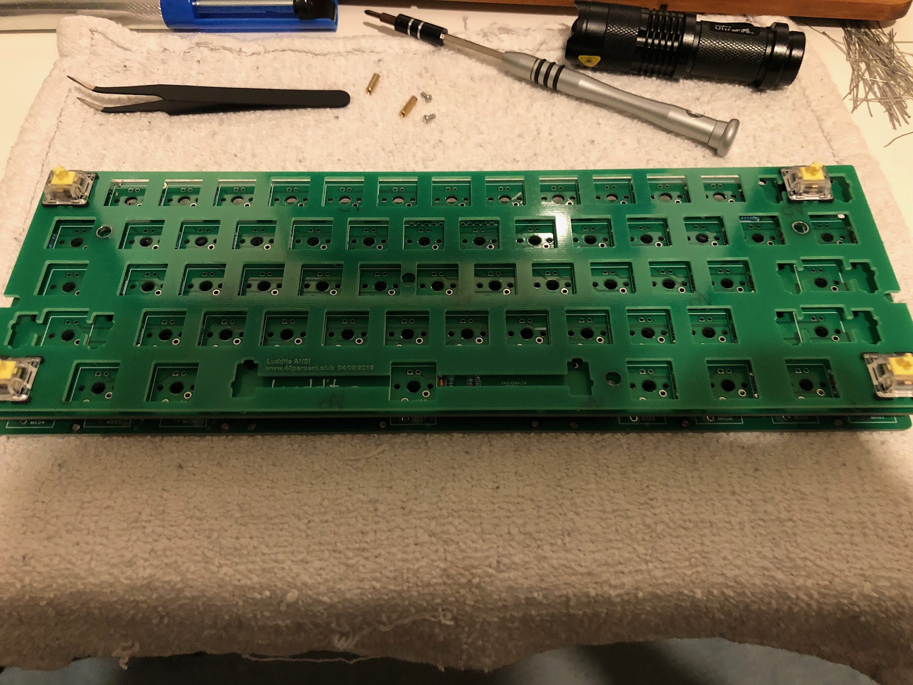

Make sure when you solder your switches that both leads are poking through the PCB! If they aren't your switch won't work and you'll have to desolder to reinstall them.

Here's an example of a missing pin:

When complete, your board should look like this:

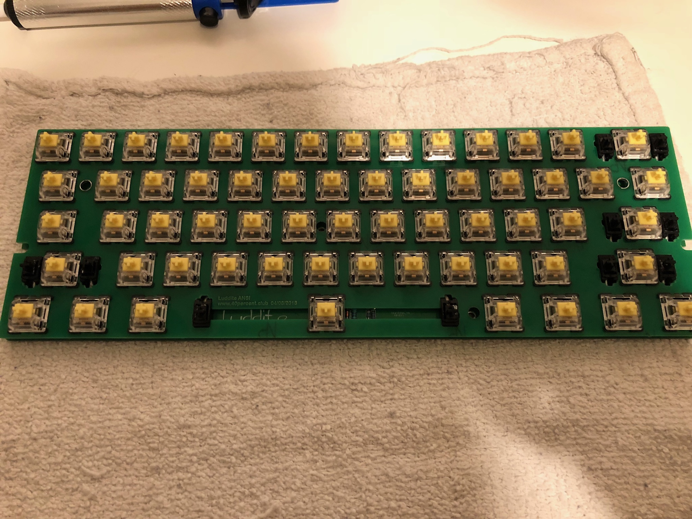

### Installing LEDS for Backlighting (Optional)

For backlighting, we support single color LEDS. For this guide, I used white ones:

On each switch, you should see holes for LEDs:

We're going to put the LEDs through these holes. Each LED has a longer side (anode, positive) and a shorter side (cathode, negative). If you notice the PCB, it has square pads and circular pads. **The shorter leg of the LED should go into the hole with the square circle**.

Once inserted, bend the legs and follow the same general technique that you did with the diodes and resistors. At the end, your board should look like this:

### Test Flash Pro Micro

Before installing our Pro Micro, let's make sure it can be flashed and functions properly.

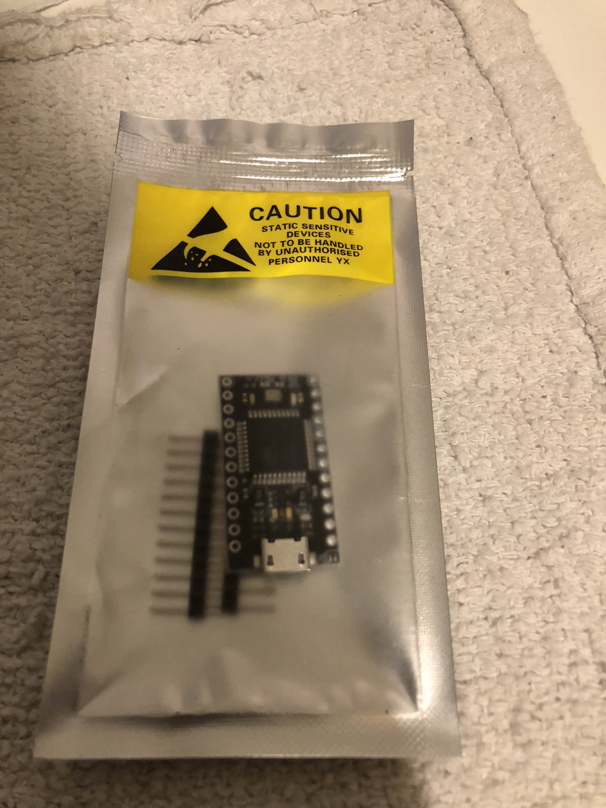

Flash your pro micro with the Luddite QMK firmware. In order to do enter flashing mode, you'll have to short the GND and RST pins on the pro micro.

I like using the QMK Toolbox software in "Auto-flash" mode. I plug the Pro Micro into my computer, set QMK Toolbox to auto-flash mode using "avrdude", then short the GND and RST pins on the pro micro with a diode leg I bend.

A compiled version of the Luddite firmware is available for download [here](https://github.com/awkannan1/luddite_docs/raw/master/static/luddite_default.hex)

For more information, you can check out QMK's [flashing guide](https://beta.docs.qmk.fm/detailed-guides/flashing)

### Pro Micro and Socket

Now, let's install our Pro Micro and sockets.

Our low profile peel-a-way sockets have 24 spots. First we need to cut them down into 2 strips of 12.

Once our sockets are cut, insert the pins into the appropriate holes on the backside of the board.

Flip your PCB back around, making sure the sockets stay in their holes.

Solder the pins to the board

.

Now our sockets are installed. Since we are using low profile sockets, we need to make sure the switches won't touch the Pro Micro.
You'll see that under the socket, the switch leads are sticking out.

.

Using your flush cutters, cut all those leads short. Then add a layer of electrical tape to prevent any further issues.

.

Now we're ready to add legs to our pro micro. We'll use the diode legs we saved from before.
Align the pro micro with the sockets as shown, using the layout on the PCB as a guide

Use a diode leg to go through one of the pro micro holes and into the sockets.

Make sure the diode leg is going cleanly into the socket.

Repeat this process for all the sockets.

Now, prior to soldering, make sure we have enough room for our USB Micro pigtail, by inserting the cable.

Alternatively, we can remove some of the housing on the cable to get as low-profile as possible.

Finally, solder all the legs to the pro Micro.

### Testing

Now, using the diode pins and sockets we installed, re-install your Pro Micro.

Once installed, connect your keyboard to a PC using a USB Micro cable. I like using http://www.keyboardtester.com/ to verify that all my keys work. If they don't, or multiple keys register on a single press, check all your diode orientations and fix them if wrong.

### Pigtail

Finally, we must install the USB pigtail. This will allow us to use the more convenient USB Mini connector we installed earlier.

First, measure how long your pigtail needs to be, and cur your micro USB cable down to length.

Next, using either scissors or your wirestripper, remove the outer layer of the USB cable:

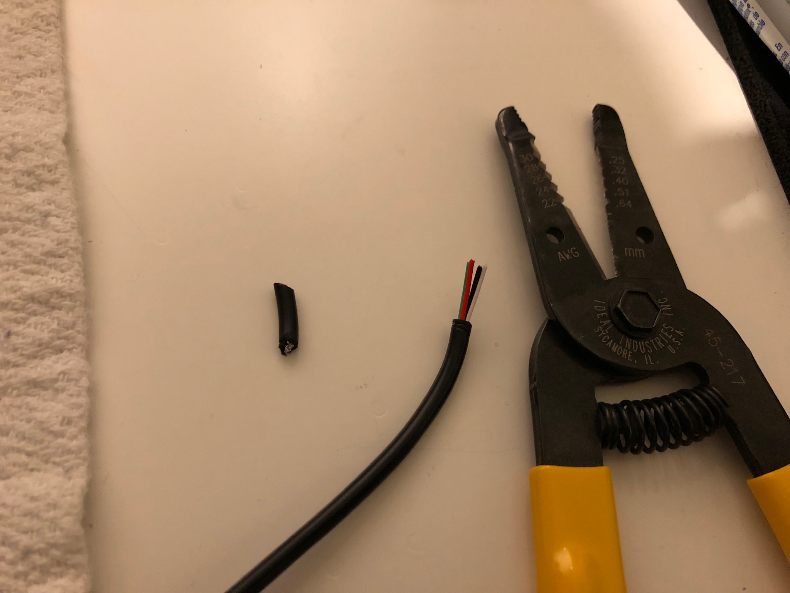

You will see 4 cables - a red, black, white, and green.

Using wire strippers, strip the ends of the 4 cables that were revealed by stripping the outer layer.

Tin each one of these now exposed mini wires:

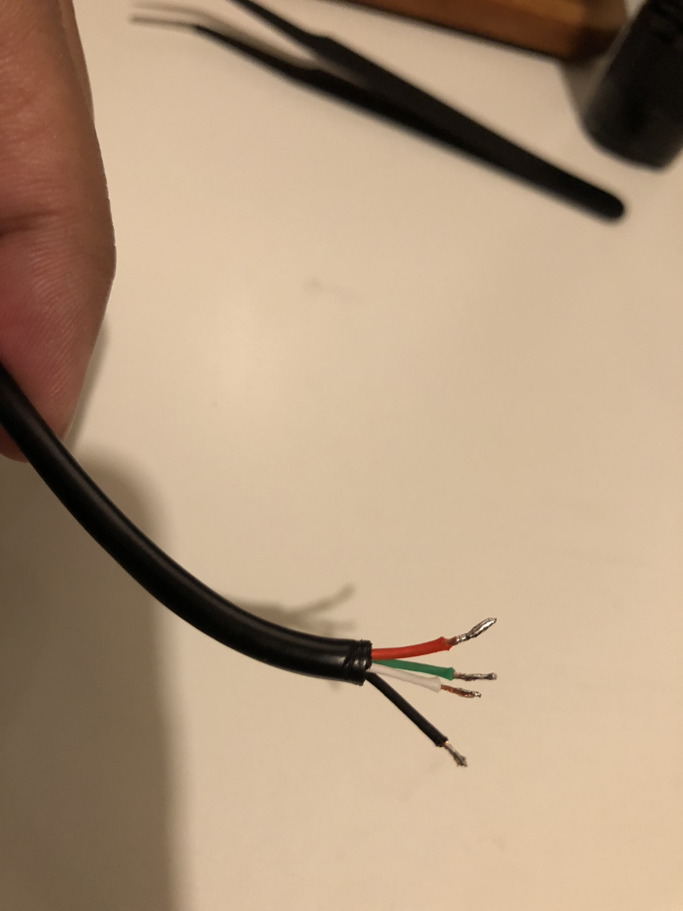

Place and solder each of the mini wires to the appropriate lead on the board. Red to VCC, White to D-, Green to D+, and Black to GND.

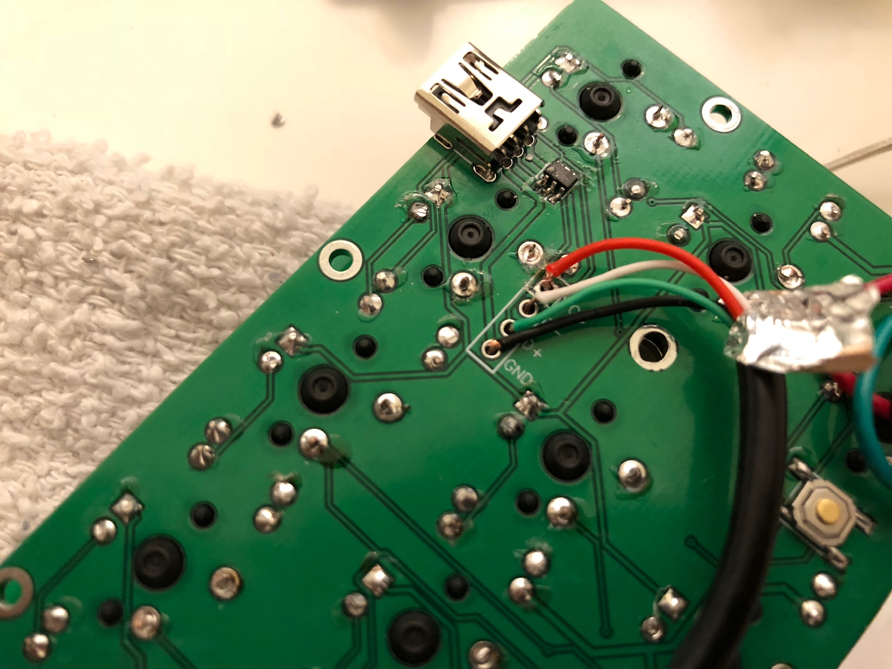

Some USB cables have metal sheathing around the wires. Make sure that those are not touching your PCB. Either remove the shielding, or wrap it in electrical tape.

When you're done, the finished pigtail should look like this:
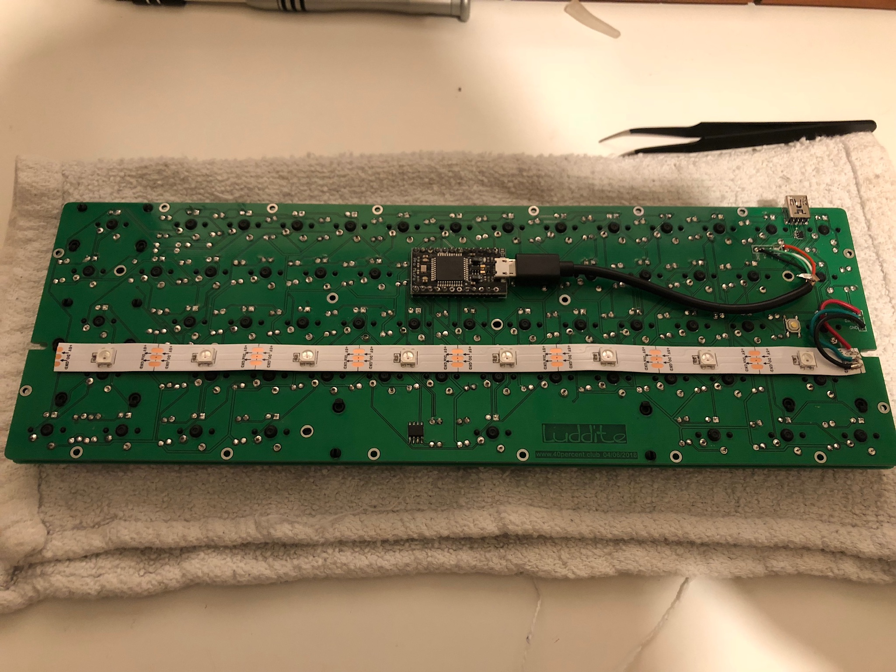

### Installing RGB Underglow (Optional)

To install RGB underglow, we must first attach the LED strip to the bottom of our PCB. Typically, they have a sticky 3M compound on them, so they'll stick. If weak, you can use electrical tape to help.

Make sure the DIN is close to the DATA contact on the PCB.

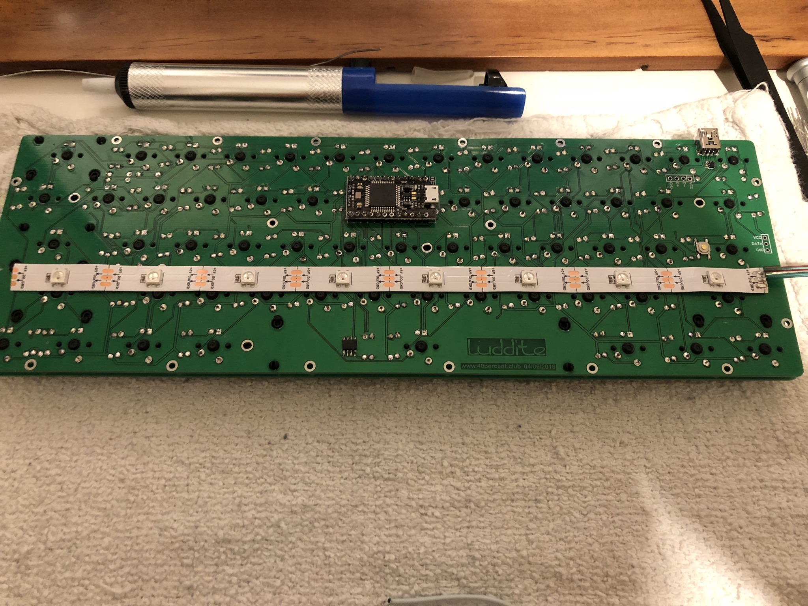

Next, add some solder to each of the pads on the LED strip:

Using some solid core wire, connect +5V on the strip to the VCC pad

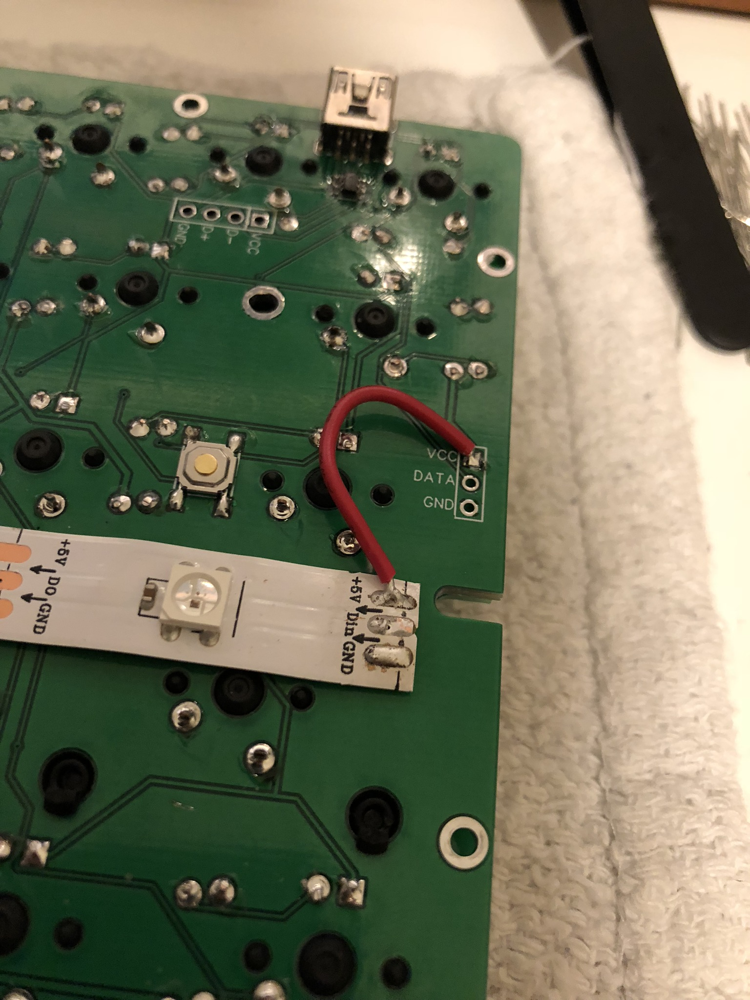

Repeat the process connecting DIN to the DATA pad and GND to GND.

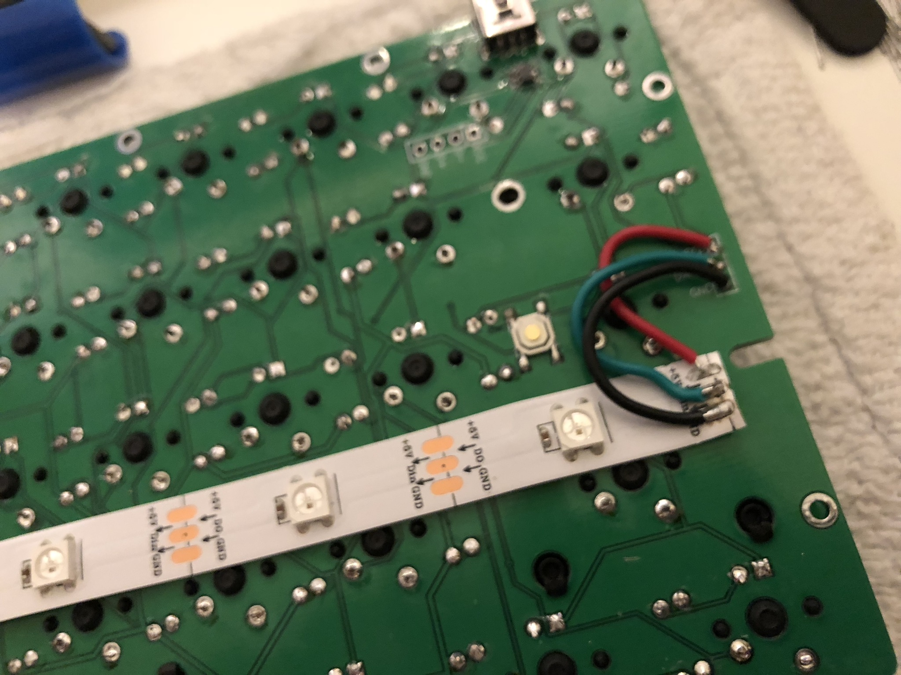

### Wrap it Up

Finally, use your remaining PCB to finish the PCB sandwich. Add rubber bumpons to the bottom of the bottom PCB.

Enjoy your Luddite board!

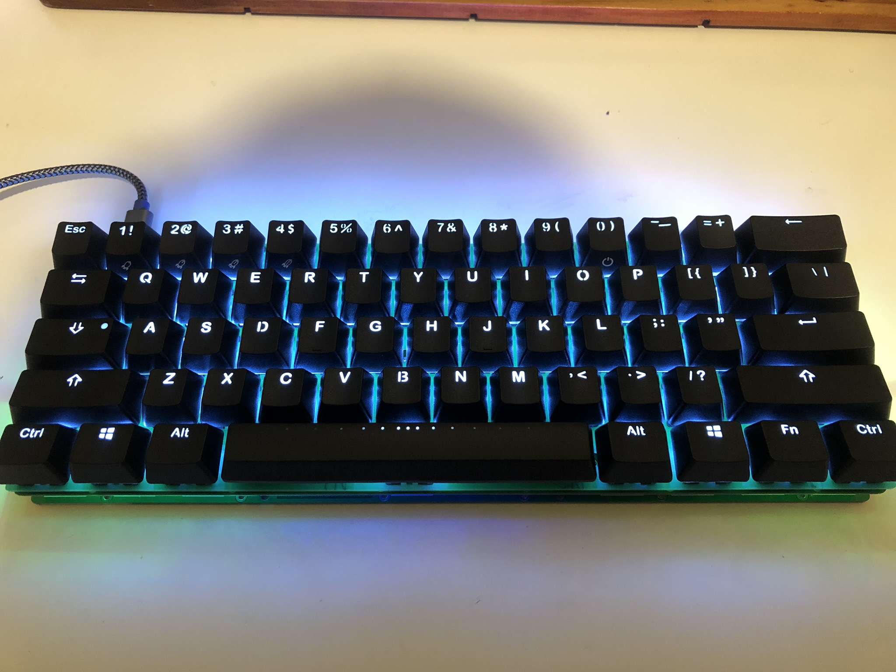
