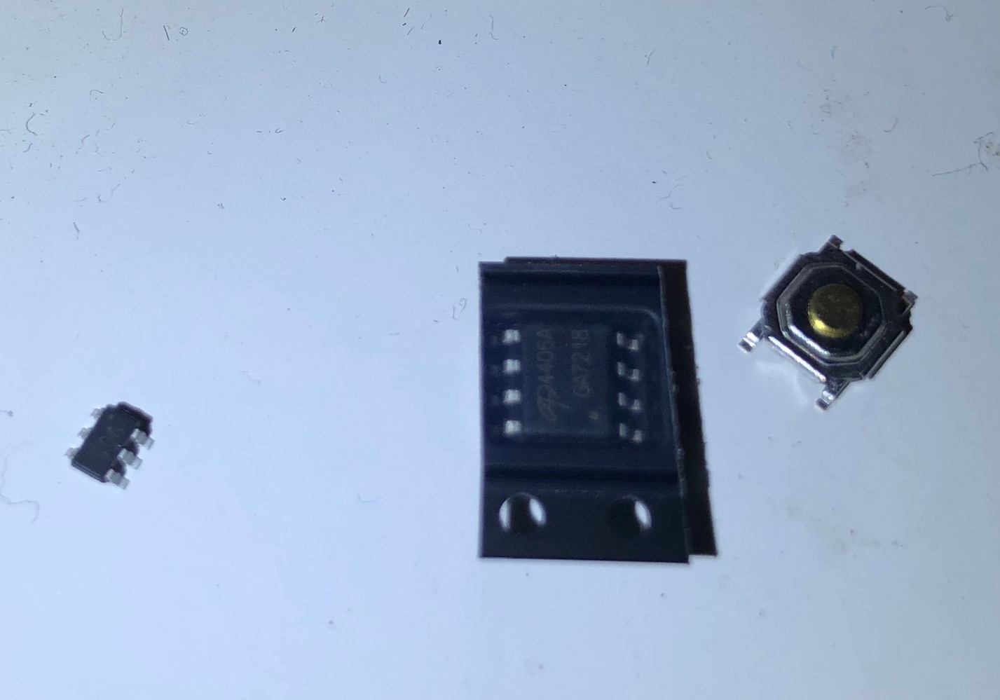
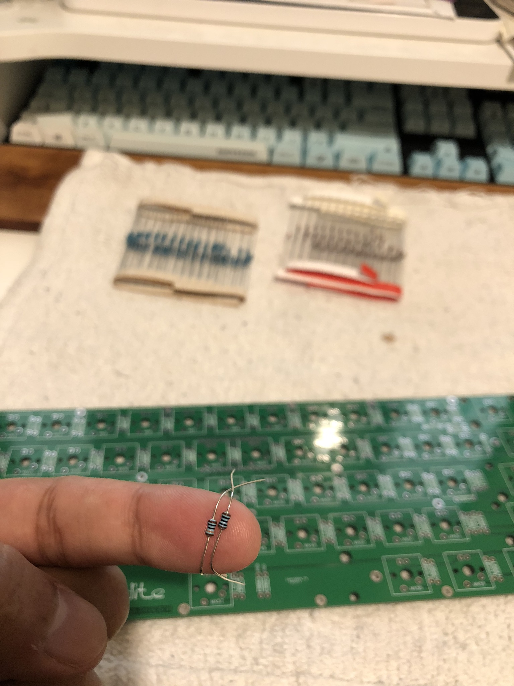
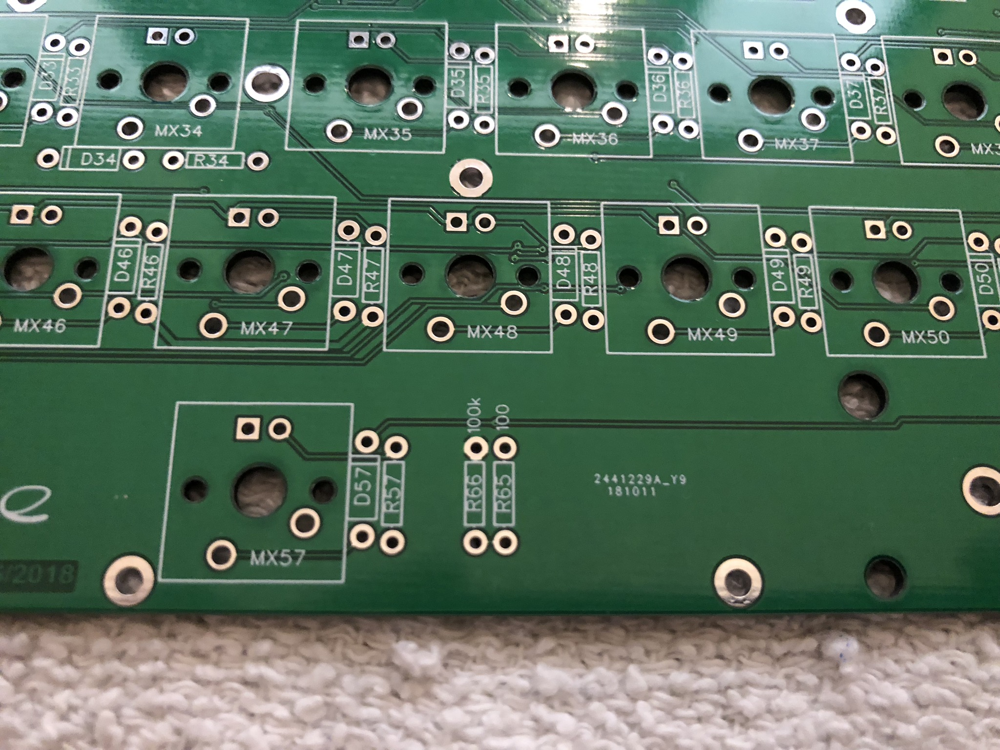
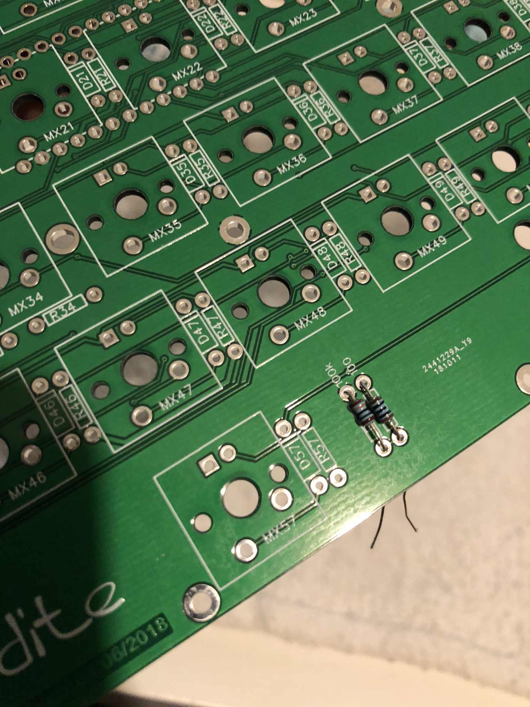
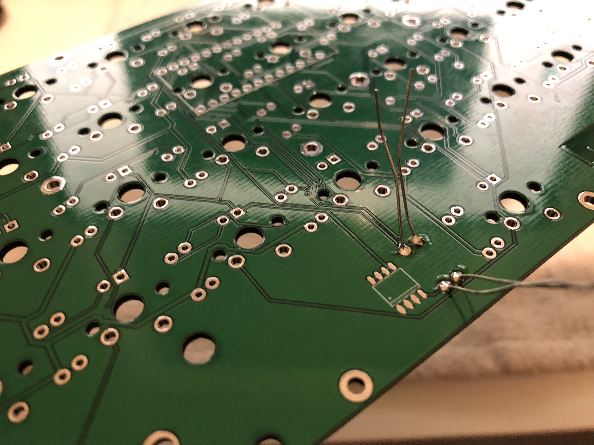
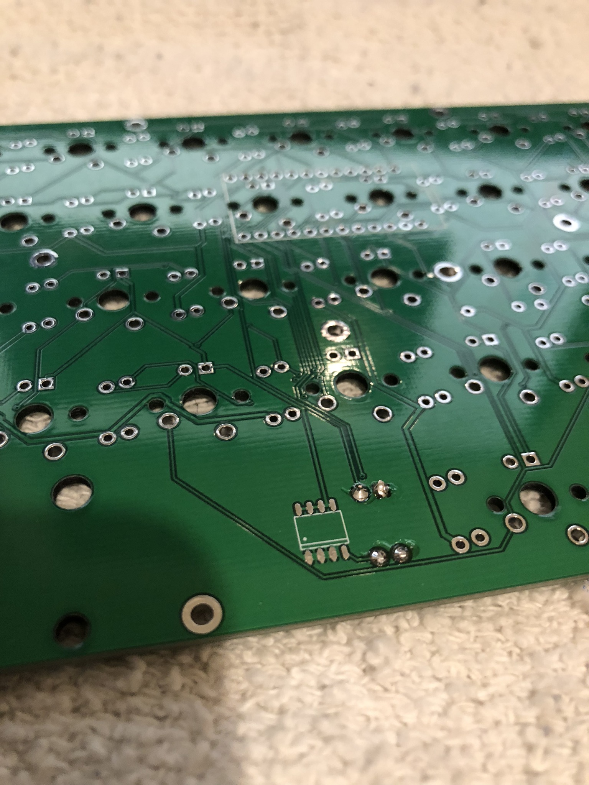
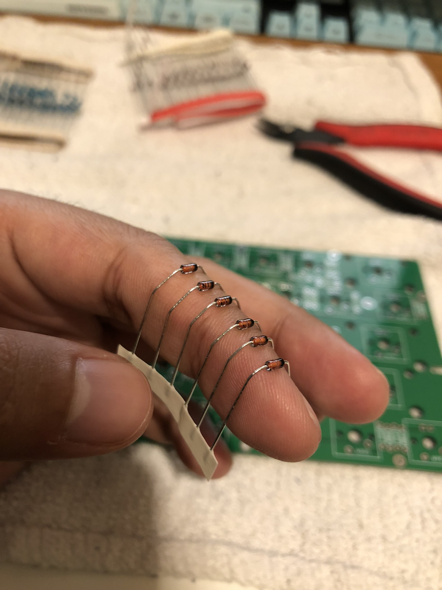
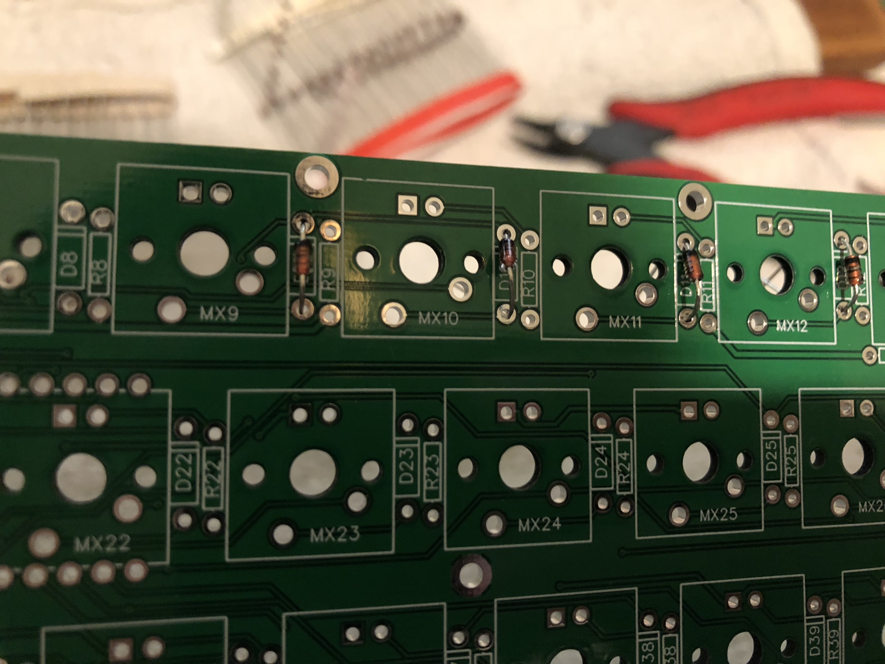
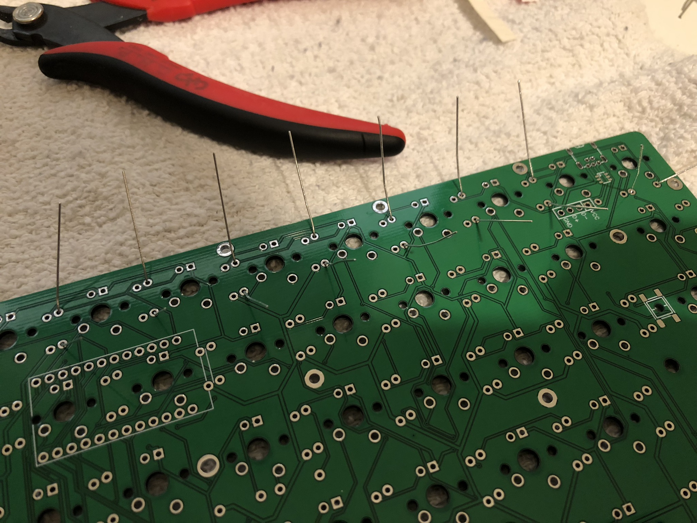

# Luddite Build Guide

A complete Luddite build can take anywhere from 2-6 hours. Pace yourself!

At the end of the process, you'll wind up with something like this:

Before we begin, let's take inventory and make sure we have all the parts necessary.

## Inventory
There are required part and optional parts. Some of the optional parts are required for LED backlighting support.

### Required
- 2x Luddite PCBs
- 61x 1N4148 Diodes
- 4x 2U Stabilizers and 1x 6.25U Stabilizer
- Pro Micro
- Peel-a-way Sockets
- Micro USB Cable
- USB Mini Connector
- Mini USB Cable
- 61x Cherry MX Style Switches
- At least 6x M2 10mm standoffs and 12x M2 4mm screws
- 4-6 Rubber Bumpons
### Optional
- 1x Luddite Plate (For plate mount switches)
- 1x WS2812b LED Strip with 8 LEDs (For RGB Underglow)
- MOSFET (For LED Backlight)
- 61x 470 Ohm Resistors (For LED Backlight)
- 61x LEDs (For LED backlight)
- 1x 100 ohm and 1x 100k ohm resistor (For LED Backlight)
- Tactile Reset Switch (For easy re-flashing)
- ESD Suppression Diode (For ESD Protection)

## Tools
You also have to have a base set of tools to complete this build.
- Soldering Iron
- Solder
- Philips head Screwdriver
- Flush cutters
- Tweezers
- Wire strippers
- Solid core wire (For RGB Underglow only)

If you're not sure what to get, I highly recommend the [Keeb.io recommended soldering tools guide](https://docs.keeb.io/soldering-tools/)

## The Process
  
Decide if you want to support RGB Underglow and LED Backlighting. This will change what you have to do during the build process.

### First Resistors for LED Backlighting (Optional, LED Backlighting) 

If I'm supporting LED backlighting, I like to start off with the 100 ohm and 100k ohm resistors. This is so I won't make a mistake later. 

The colors on the resistors should match the ones shown.  
The 100 ohm resistor is colored brown, black, brown.  
The 100k ohm resistor is colored brown, black, yellow.  

Find the spots on the board where these resistors should go. They are labeled:

Put the resistors through their respective holes. Bend the leads before installing the resistors:

On the underside of the board, solder the resistors to their pads:

Finally, flush cut the resistors close to the board:

You'll be repeating this process many times throughout this build.

### Diodes (Required)

The next thing we're going to do is install all 61 diodes.
Your diodes come in a long strip. I like installing them in groups of 6, but you can find what works for you.

First, bend the legs of the diodes to make them easier to insert. I bend them around my finger. 

Next, insert the diodes into the spots marked with the letter "D" on the PCB. Make sure the black band on the diode aligns with the bands marked on the PCB.

For the most part, the bands point upwards, but sometimes the diodes are sideways.

Bend the legs of the diodes to hold them in place so you can turn the PCB over:

Solder the legs of the diodes to the pads, and flush cut the legs off. Make sure you save your legs! We'll be using them later to socket our ProMicro.

