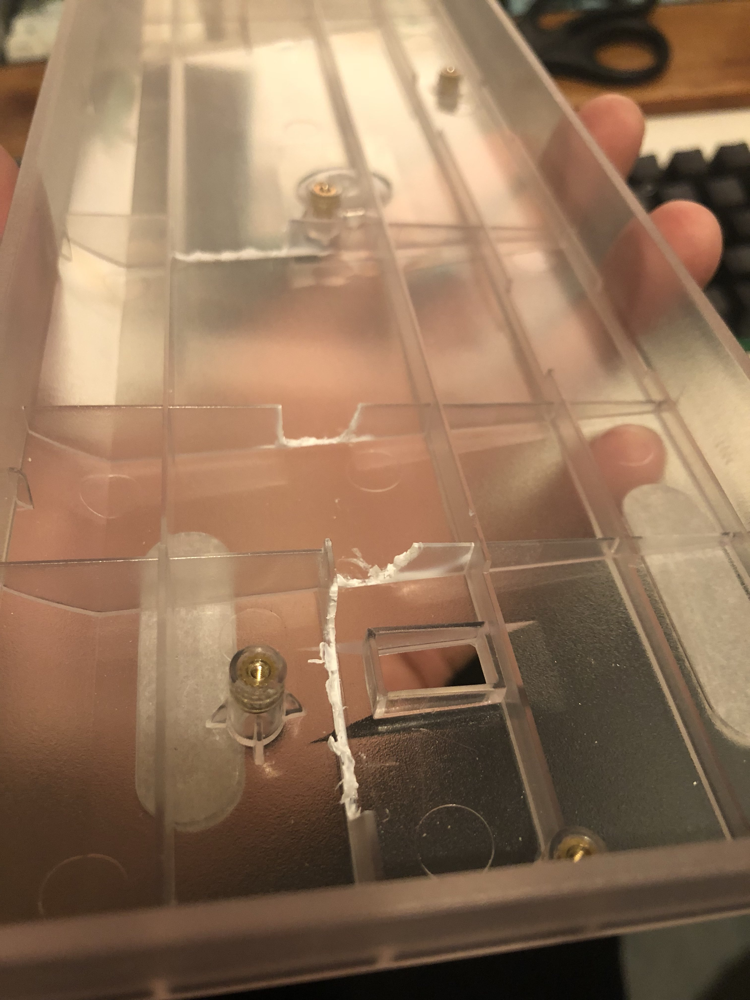
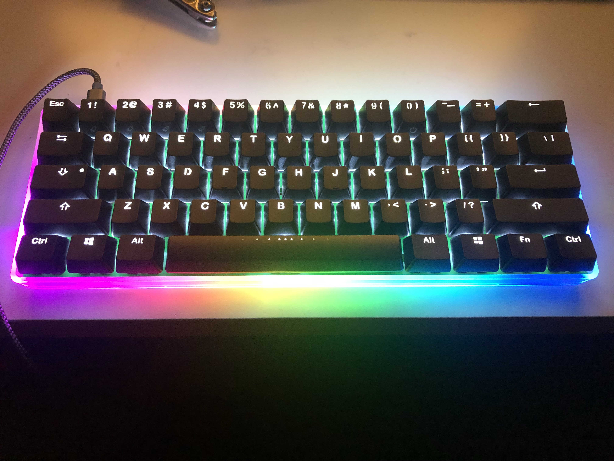

# Case Compatibility

Most cases expect the 60% PCB to have on-board components. The Luddite uses a Pro Micro. As such, the total thickness of the board
is greater than that supported by many cases. That said, there are some options.

Using the Pro Micro headers, the micro USB port ends 6mm away from the PCB. The pigtail using a micro USB cable adds about 8mm. It's possible
to remove the housing of the micro USB plug to save some depth.

Using low profile sockets, we can probably save another 2mm, bringing us to 4mm depth. I don't believe we can get much thinner than that.

## Specific Cases

This section is open to contribution. If you try the Luddite in a new case, please make an entry here.

### [Cheap Plastic Case from AliExpress](https://www.aliexpress.com/item/GH60-Compact-Keyboard-Base-Seat-60-Keyboard-Poker2-Plastic-Frame-Case/32906642473.html?spm=a2g0s.9042311.0.0.20024c4dGeDGPP)
This case worked with some modification. Plastic fins had to be removed to make room for the pigtail. The pro micro itself did not conflict with the fins.

